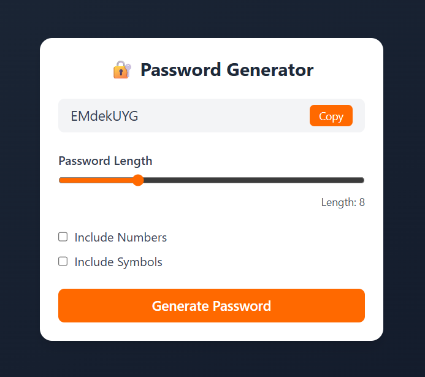

# 🔐 Password Generator

A simple and stylish **Password Generator** built with **React** and **Tailwind CSS**. Instantly create secure and customizable passwords based on your preferences.

## 🌟 Features

- 🎛️ Choose password length (4 to 20 characters)
- 🔢 Option to include numbers
- 🔣 Option to include special characters
- 📋 One-click copy to clipboard
- ⚡ Real-time password generation
- 🎨 Responsive and clean UI using Tailwind CSS

## 📸 Demo



## 🚀 Getting Started

### Prerequisites

- Node.js
- npm

### Installation

```bash
git clone https://github.com/MKG0007/strong-pass-creator.git
cd strong-pass-creator
npm install
npm run dev
